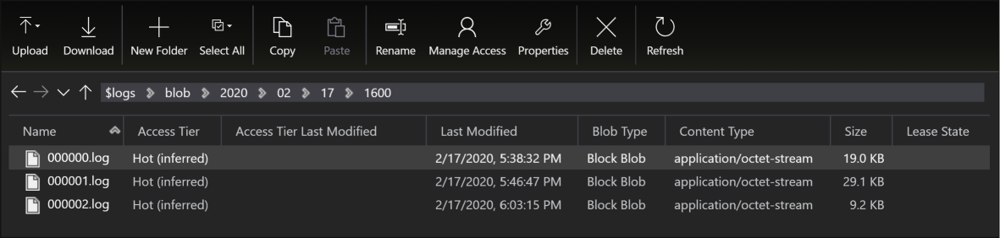
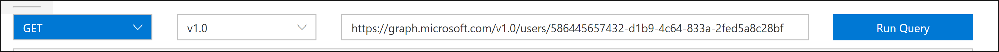
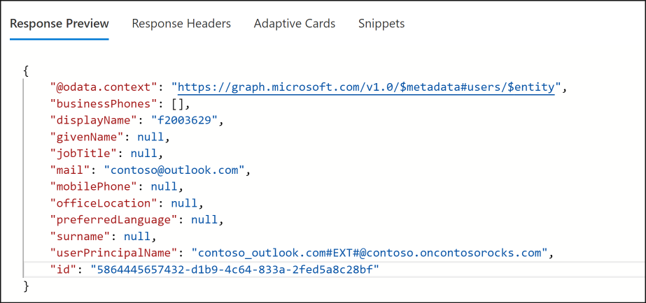

# Identify the user/application from Data lake audit logs
Recently I had a customer conversation where customer want to understand the identity of the user or application accessing the enterprise data lake for audit purposes. This is not as straight-forward as looking at audit logs and getting details of the user, so I have decided to put a blog on how to do this. Please note that the following blog only makes sense when the access is via Azure Active Directory and NOT via access keys. When you access the storage account via access keys, I don't think there is a way to track this as anyone who has the key can use storage account. 

## Enable Audit logs
First step is to enable analytical logging on storage account where Hierarchical Name Space (HNS) is enabled. [Here](https://docs.microsoft.com/azure/storage/common/storage-analytics-logging) is a link on how to enable this at a storage account level. Also do note that this enables analyzing the data plane operations at storage account level as against activity log which supports control plane logging. 

## Navigate through audit logs
Once you enabled this at storage account, there will be a container with name $logs created in the storage account. This account also has folder structure (based on time of access) for you to navigate and look at specific files. Folder structure is granular to take you up to one hour. Logs will be named in the numeric sequence starting with 000000. 

## Understand the log structure
When you open a log file, you will see data corresponding to actions that were performed on storage account. It is easy to get lost with so much amount of data that is present in the log. [This](https://docs.microsoft.com/rest/api/storageservices/storage-analytics-logged-operations-and-status-messages#logged-operations) article describes all operations that will be logged, but here are some of the important operations and what they correspond to:

| Operation Name | Action on Storage |
| ----------- | --------| 
| CreateFileSystem | Creating a container in Data Lake Storage account |
| DeleteFileSystem | Deleting a container in Data Lake storage account |
| CreatePathDir | Creating a directory|
| DeleteDirectory | Deleting a directory |
| ReadFile | Reading a file |
| DeleteFile | Deleting a File |

Once you identify the operation, search for the operation in the log file. If there are multiple entries use filters such as file name, time of the operation (if you know) to narrow down the results. Once you have the correct log entry, next step is to understand the log format. [This](https://docs.microsoft.com/rest/api/storageservices/storage-analytics-log-format) article describes the log format. The first field in the log entry is the format version and based on the format version, you can decode the entry. 

## Fetch the user from log entry
Once you map the log entry, you will only get the OAuth ID of the user and not actual user details. So, you need to map the format specified in above article and extract the value of the field corresponding to " user-object-id" or "application-id". "User-object-id"  is 8th entry from the end. 

Once you have user-object-id, you can use [Microsoft Graph](https://developer.microsoft.com/graph/graph-explorer) to get the details on the user. 

In the response to the query, you will find details about the user:

