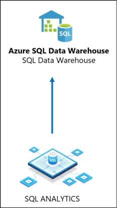
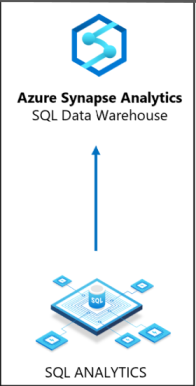
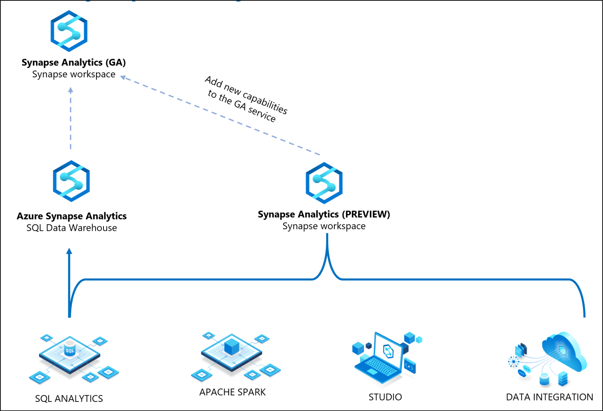

# Demystifying Azure Synapse Analytics
Azure Synapse Analytics, announced during Ignite 2019, is a powerful analytical tool that brings Big Data analytics with traditional SQL analytics to surface powerful insights. However, there is a ton of confusion on what is in preview and what is in general availability (GA). This post only aims to clear that confusion and doesn't go onto the depth of functionality provided. 

In Azure, capabilities are provided by a service. First step to use these capabilities is to create a resource corresponding to it. For example, to use object storage or files or queues capabilities provided by Azure, you use Azure Storage service and you create a "Storage account" resource. 

## Evolution of Synapse Analytics
Before November 4th, 2019, SQL Analytics capabilities were offered by a service called Azure SQL Data warehouse and you create a resource "SQL Data warehouse" to get these capabilities. 

On a good day, Microsoft decided to change the name of the service to "Azure Synapse Analytics" and it still provides the same capabilities as SQL data warehouse. Just a name change!

In addition to the name change, Microsoft introduced a set of capabilities that bridge the gap between Big Data Analytics and SQL Data Analytics by offering a set of capabilities like, Apache Spark, Data integration capabilities and a unified Studio experience to make it easy for Data Scientists as well as Business Intelligence analysts to make sense of the data they have and eliminating silos. These set of capabilities were offered to a set of private preview customers under a resource called "Synapse workspace" offered by a service which is in preview for these capabilities. For customers, who are not in preview, they continue to use traditional data warehouse under a new name. Nothing changed for customers who are not in preview and they can run their production workloads in their data warehouse.

Now in order to make these set of capabilities available for existing customers who are not in private preview, Microsoft will merge these changes into main code base and automatically migrate all customers using traditional data warehouse resource into Synapse workspace resource at the time of general availability of these preview described above. 

By doing so, Microsoft will be able to offer an unified analytics development experience, running at a Petabyte scale unlocking powerful insights by eliminating silos that existed between data and roles using that data. 

## Disclaimer
This is my understanding based on what I learnt and saw in the presentations and videos. Feel free to correct my understanding. Importantly, this information doesn't have a legal hold. 
